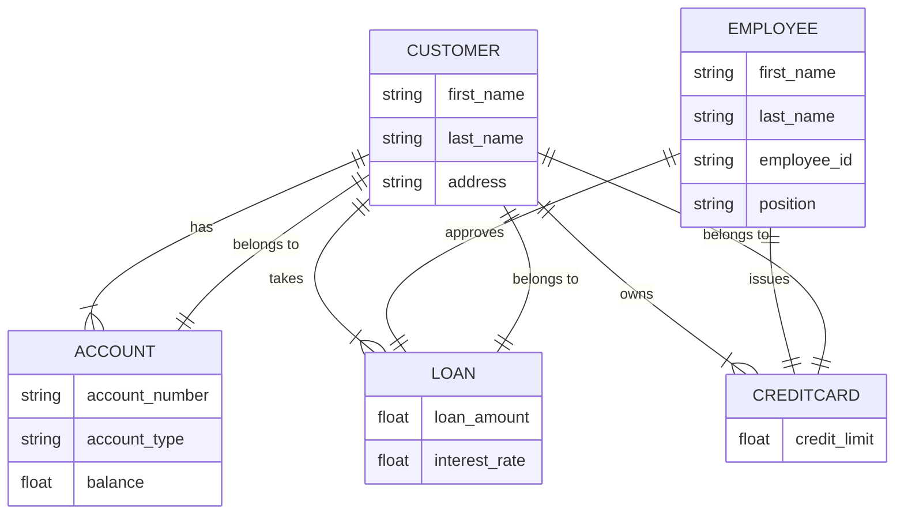
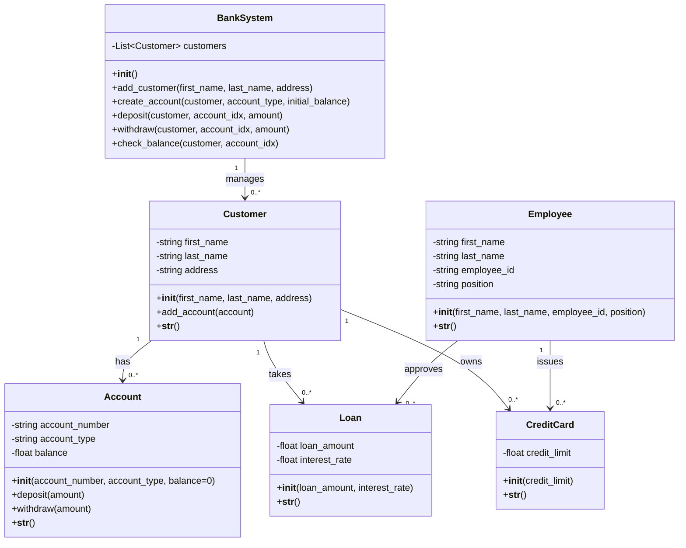

# Banking System

This project implements a simplified version of a banking system using Python. It includes entities like `Customer`, `Account`, `Employee`, `Loan`, and `CreditCard`, along with their interactions and functionalities.

## Table of Contents

- [Overview](#overview)
- [Entities](#entities)
- [Functionality](#functionality)
- [Usage](#usage)
- [Installation](#installation)
- [Contributing](#contributing)
- [License](#license)

## Overview

The banking system is designed to simulate basic banking operations such as creating customers, managing accounts, processing loans, and issuing credit cards. The program is implemented in Python and utilizes object-oriented programming (OOP) principles to organize and manage data.

## Entities

### Customer

Represents a customer in the banking system.

Attributes:
- `first_name`: First name of the customer.
- `last_name`: Last name of the customer.
- `address`: Address of the customer.
- `accounts`: List of accounts associated with the customer.

### Account

Represents a bank account.

Attributes:
- `account_number`: Unique identifier for the account.
- `account_type`: Type of the account (checking/savings).
- `balance`: Current balance of the account.

### Employee

Represents an employee of the bank.

Attributes:
- `first_name`: First name of the employee.
- `last_name`: Last name of the employee.
- `employee_id`: Unique identifier for the employee.
- `position`: Position or role of the employee.

### Loan

Represents a loan service provided by the bank.

Attributes:
- `loan_amount`: Amount of the loan.
- `interest_rate`: Interest rate of the loan.

### CreditCard

Represents a credit card service provided by the bank.

Attributes:
- `credit_limit`: Credit limit of the credit card.



## Functionality

The program provides the following functionalities:

- **Customer Management:**
  - Adding new customers with basic information.
  - Associating accounts with customers.

- **Account Management:**
  - Creating different types of accounts (checking/savings).
  - Depositing and withdrawing money from accounts.
  - Checking the balance of accounts.

- **Employee Actions:**
  - Approving loans for customers.
  - Issuing credit cards to customers.

- **Data Persistence:**
  - Data is stored in a JSON file (`bank_data.json`) to maintain customer and employee records across sessions.

# Banking System UML Diagram



## Usage

To use the banking system:
1. Clone the repository:
   ```bash
   git clone https://github.com/your-username/banking-system.git
   cd banking-system
